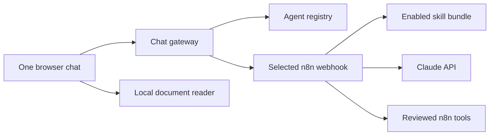

# Add another agent or workflow

The browser is a reusable agent shell. Agent choices come from one registry
instead of being hard-coded into separate applications.

## How a request moves

The reusable pieces are:

- `apps/chat/config/agents.json` — display names, status, prompts, and n8n
  webhook path;
- `apps/chat` — one UI and gateway for every agent;
- `services/document-worker` — shared PDF, DOCX, and TXT extraction;
- `skills` — small Markdown behaviour modules;
- `n8n/workflows` — visual orchestration and reviewed tool connections.

Project Manager is the only active agent. Sales, Marketing, Investment, and
Bookkeeping are intentionally disabled placeholders in the sidebar.

## Add a skill to Project Manager

1. Copy an existing directory below `skills`.
2. Give the new directory and `skill.yaml` the same lowercase kebab-case ID.
3. Write focused instructions in `SKILL.md`.
4. Add the ID to `skills/enabled.txt`.
5. Run `sync-skills.command` on macOS or `sync-skills-windows.cmd` on Windows.
6. Start a new conversation and test normal, ambiguous, and adversarial input.

The compiler validates metadata, size, duplicate IDs, and the combined
instruction limit before n8n receives anything.

## Activate a future agent

This is a technical-contributor task. Do not activate a sidebar button until
its workflow and safety tests are ready.

1. Export a new n8n workflow into `n8n/workflows`.
2. Give it a unique production webhook, for example `/webhook/sales-chat`.
3. Apply the same request validation, document boundaries, response contract,
   timeout, and credential rules used by workflow `00`.
4. Connect only reviewed tools. Reads may be automatic; consequential writes
   need an explicit proposal and confirmation design.
5. Decide which skills belong to that workflow. A future workflow may read its
   own stable `agent_config` row so skill bundles do not leak between roles.
6. In `apps/chat/config/agents.json`, set that agent's `workflowPath` and change
   `status` from `coming-soon` to `active`.
7. Run `node scripts/validate-workflows.mjs`, the gateway tests, and
   `./scripts/test-phase5.sh`.
8. Restart with `./scripts/run-local.sh restart`.
9. Verify the new button starts an isolated conversation and reaches only its
   intended webhook.

The gateway derives the internal n8n URL from the selected registry entry. It
never accepts an arbitrary workflow URL from the browser, which prevents users
from turning the chat endpoint into an open proxy.

## Rules for future service connections

- Keep credentials in n8n's encrypted credential store, never in browser code,
  Git, skills, or document text.
- Prefer one small n8n subworkflow per capability.
- Label every capability as read, proposal, write, or destructive.
- Make write tools idempotent and auditable.
- Require explicit confirmation for external messages, money movement,
  deletion, publication, and material record changes.
- Validate tool input again inside the subworkflow.
- Return small structured results to the agent.
- Add a mock-backed test before a new integration is used in a workshop.

This keeps the beginner surface simple while giving technical teams clean
extension points behind it.
