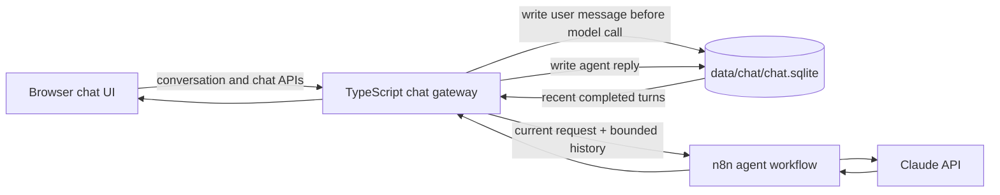

# Durable local chat and conversation memory plan

**Implementation status:** complete on `codex/local-chat-persistence`. The
“Baseline before implementation” section records the problem this branch was
designed to solve; the remaining sections describe the implemented design and
its acceptance criteria.

## Outcome

Every user and agent message is stored in a private local SQLite database. A
learner can stop the whole stack, restart it later, browse earlier
conversations, search their contents, and continue one with its recent context
restored to the agent.

This feature deliberately separates three ideas:

1. **Chat history** is the complete, durable transcript that can be browsed and
   searched.
2. **Conversation memory** is a bounded selection of that transcript supplied
   to the model on the next turn.
3. **Cross-conversation memory** is a future, opt-in feature for saved facts or
   preferences. It is not inferred from every chat in this phase.

The first two are in scope. A new conversation remains a clean context boundary.

## Baseline before implementation

The existing app is intentionally ephemeral:

- `apps/chat/public/app.js` stores one UUID in browser `localStorage`, but stores
  no messages.
- Messages exist only as DOM elements. Reloading the page replaces them with the
  welcome message.
- Selecting **New conversation** replaces the UUID, so the previous UUID is no
  longer reachable through the UI.
- n8n Simple Memory retains six interactions under `agentId:sessionId`, but its
  contents live only in the n8n process and disappear when n8n stops.
- Extracted document text is stored separately in `data/documents/`, is bound to
  a session UUID, and expires after 24 hours.
- Normal stop/start preserves `data/`, but the backup helper currently archives
  only n8n data and the private environment file.

No migration can recover transcripts created before this feature because they
were never written to disk.

## Recommended architecture

Use one file-backed SQLite database owned by the chat gateway:

```text
data/chat/chat.sqlite
```

Use the `node:sqlite` module included with the repository's pinned Node.js
24.18.0 runtime. This keeps setup local and adds no package, native build, Docker
container, account, or network service. The API is release-candidate status, so
the repository must keep its pinned runtime and include a compatibility smoke
test. See the [Node.js SQLite documentation](https://nodejs.org/docs/latest-v24.x/api/sqlite.html).

SQLite is the single source of truth for transcripts. Do not put a second copy
of chat history in browser storage or an n8n Data Table.



### Why the gateway owns the database

- The browser already talks only to the gateway, so the existing security
  boundary remains intact.
- The UI and the agent consume the same canonical records.
- The transcript survives even when n8n is stopped, reset, or temporarily
  unavailable.
- Prepared SQL, migrations, file permissions, backup, and error handling stay in
  reviewed application code rather than a visual workflow.
- It avoids adding Postgres or Redis to a beginner workshop.

## Data model

Create `apps/chat/src/chat-store.ts` and keep all SQL behind a small `ChatStore`
interface. Use schema migrations driven by `PRAGMA user_version`; startup applies
forward migrations in transactions and never silently replaces a corrupt
database.

### `conversations`

| Column | Purpose |
| --- | --- |
| `id TEXT PRIMARY KEY` | UUID; this remains the existing `sessionId` |
| `agent_id TEXT NOT NULL` | Prevents history leaking between agent roles |
| `title TEXT NOT NULL` | First user message, normalised and truncated; user-renamable |
| `created_at TEXT NOT NULL` | UTC ISO timestamp |
| `updated_at TEXT NOT NULL` | UTC ISO timestamp used for recent ordering |

Titles should be generated locally from the first user message, with no extra
model call or API cost. Use `New conversation` until the first message exists,
then a whitespace-normalised title of at most 80 characters.

### `messages`

| Column | Purpose |
| --- | --- |
| `id TEXT PRIMARY KEY` | Server-generated UUID |
| `conversation_id TEXT NOT NULL` | Foreign key with cascade delete |
| `request_id TEXT NOT NULL` | One client-generated UUID shared by a user turn and its reply |
| `role TEXT NOT NULL` | `user` or `assistant` |
| `content TEXT NOT NULL` | Plain text transcript content |
| `status TEXT NOT NULL` | `pending`, `complete`, `failed`, or `interrupted` |
| `error_code TEXT` | Stable, safe code only; never raw provider data |
| `run_id TEXT` | Optional n8n execution ID returned with the reply |
| `created_at TEXT NOT NULL` | UTC ISO timestamp |
| `sequence INTEGER NOT NULL` | Stable per-conversation transcript ordering |

Use a unique constraint that prevents the same `request_id` and role from being
inserted twice. Keep deterministic ordering with `sequence`. On gateway
startup, change leftover `pending` messages to `interrupted`; do not
automatically replay them because the external workflow may already have run.

### `message_attachments`

Store only the metadata needed to render an old user message:

- message and document IDs;
- safe display name and type;
- MIME type, word count, character count, page count, and expiry time.

Do not duplicate document text or original file bytes into the chat database.
The existing document store remains the short-lived source context. After its
24-hour expiry, the transcript still shows the attachment metadata and labels
it as expired, but continuing the chat does not resend that old document.

### Search index

Add an FTS5 external-content table over message content, maintained by insert,
update, and delete triggers. Search results return conversation ID, title,
matching message ID, a short escaped snippet, role, and timestamp. If the pinned
runtime ever lacks FTS5, startup must report a clear compatibility failure rather
than degrading silently.

### Database settings

Open one connection in the gateway and set:

```sql
PRAGMA foreign_keys = ON;
PRAGMA journal_mode = WAL;
PRAGMA synchronous = NORMAL;
PRAGMA busy_timeout = 5000;
```

Create `data/chat/` with owner-only permissions where the operating system
supports them, and set the database file to mode `0600` on macOS. The database
contains plaintext chat content and must remain covered by the existing
`data/` Git ignore.

## API contract

Keep `sessionId` as the external name for compatibility. In the new code it is
also the conversation ID.

### Conversation endpoints

| Method and path | Behaviour |
| --- | --- |
| `GET /api/conversations?limit=50&cursor=...` | List recent conversations for all active agents |
| `POST /api/conversations` | Create a conversation for a validated active `agentId` |
| `GET /api/conversations/{id}?limit=100&before=...` | Return metadata and a page of messages |
| `PATCH /api/conversations/{id}` | Rename with a 1–80 character title |
| `DELETE /api/conversations/{id}` | Permanently delete the transcript after UI confirmation |
| `GET /api/conversations/search?q=...&limit=50` | Full-text search with message snippets |

Use opaque cursors, stable maximum limits, prepared statements, the current JSON
error envelope, and `Cache-Control: no-store`. A UUID remains routing data, not
authentication; the app is still a single-user loopback-only tool.

### Chat request change

The browser adds a `requestId`:

```json
{
  "requestId": "d1b6c5f2-1ee0-4d15-90bc-4f8300262e43",
  "sessionId": "9d4482cf-f720-4f70-98af-e337db1a9d53",
  "agentId": "project-manager",
  "message": "What did we decide about the launch?",
  "documentIds": []
}
```

For a valid old client that supplies no `requestId`, the gateway generates one.
For a valid session UUID not yet in SQLite, the gateway creates the conversation
on first send. This preserves compatibility with an existing browser tab.

The successful browser response adds `messageId` and `requestId` as optional
fields while retaining `sessionId`, `reply`, and optional `runId`.

### Gateway-to-n8n contract version 3

Send recent durable history in addition to the current instruction:

```json
{
  "schemaVersion": 3,
  "requestId": "d1b6c5f2-1ee0-4d15-90bc-4f8300262e43",
  "sessionId": "9d4482cf-f720-4f70-98af-e337db1a9d53",
  "agentId": "project-manager",
  "message": "What did we decide about the launch?",
  "history": [
    { "role": "user", "content": "Summarise the launch plan." },
    { "role": "assistant", "content": "The launch has three stages..." }
  ],
  "documents": []
}
```

Only complete user/assistant pairs are eligible for model context. Take the
newest six completed turns that fit within 24,000 characters, then restore them
to oldest-first order. The complete transcript remains browsable even though
only this bounded window is sent to the model.

Update `Validate and Normalise` in the main n8n workflow to validate every
history role and content limit. Update `Build Agent Context` to place prior turns
inside explicit conversation-history boundaries and keep the current user
instruction distinct. Previous assistant statements are context, not a source
of truth for stored task facts.

Remove the `Conversation Memory` Simple Memory connection once contract version
3 is active. Keeping both would duplicate recent turns and make behaviour differ
before and after a restart. Continue to accept schema versions 1 and 2 during the
migration window with empty supplied history.

## Turn lifecycle and crash behaviour

For each message:

1. Validate the request, conversation, agent, limits, and documents.
2. In one short transaction, create the conversation if needed, insert the user
   message as `pending`, snapshot attachment metadata, and update the title and
   `updated_at`.
3. Read the bounded completed history, excluding the current pending turn.
4. Call n8n without holding a database transaction open.
5. On success, in one transaction mark the user message `complete`, insert the
   assistant message as `complete`, and update the conversation timestamp.
6. On a safe gateway error, mark the user message `failed` with only its stable
   error code. The UI can display **Reply failed — try again** after a reload.

Duplicate POSTs with a completed `requestId` return the stored response. A
duplicate while still pending receives a conflict response. An interrupted turn
is shown but is not automatically resent. This matters for exact confirmation
messages: the task write may have completed even if the browser did not receive
the reply, and blindly replaying it would be unsafe.

## Browser experience

Add a **Chats** section to the existing left panel and a history drawer on small
screens.

Required behaviour:

- Show conversations newest first with title, agent, and relative update time.
- Restore the last-opened conversation when its localStorage ID still exists.
- Otherwise open the most recent conversation; if none exists, create an empty
  one.
- Selecting a conversation loads its stored messages and keeps the composer
  ready to continue it.
- **New conversation** creates a stored empty conversation instead of discarding
  the old UUID.
- Search returns matching snippets; selecting one opens the conversation and
  focuses the matching message.
- Allow rename and permanent delete from a small conversation menu. Deletion
  requires explicit confirmation and moves focus predictably.
- Render all stored text through `textContent`, as today.
- Show attachment metadata on old user messages and an `Expired` state when its
  source context is no longer available.
- Paginate long conversation lists and transcripts rather than putting an
  unbounded number of nodes in the DOM.
- Preserve keyboard navigation, screen-reader labels, reduced motion, loading
  states, and the mobile layout.

The welcome message is presentation, not a stored model turn. Display it for an
empty conversation and hide it once real messages are loaded.

## Local lifecycle, backup, restore, and reset

### Start and stop

- Add `CHAT_DATA_DIRECTORY=data/chat` to the gateway environment.
- Open and migrate the database before the health endpoint reports ready.
- A normal stop closes the HTTP server, checkpoints WAL, and closes SQLite.
- A normal start reopens the same database and leaves transcripts untouched.
- Diagnostics run `PRAGMA quick_check`, report the schema version, and confirm
  that search is available without printing any chat content.

### Backup

Extend the existing backup format with a versioned `backup.json` manifest and a
`chat-data/` copy. Briefly stop the chat gateway first so shutdown checkpoints
WAL, copy the database, then restart any service that was running. Continue to
back up n8n data and `.env` as today.

Backups now contain plaintext chat transcripts as well as encrypted n8n
credentials. All learner-facing backup text must say that clearly and tell users
to keep the folder private.

Document extraction records do not need to enter the durable chat backup. They
are temporary source material and old messages retain their metadata without
them.

### Restore

- Accept the old n8n-only backup format for backward compatibility.
- For the new format, validate the manifest and SQLite integrity before replacing
  current data.
- Stop chat, document worker, and n8n; restore into staging paths; then replace
  the target data and restart the stack.
- If a new backup has no chat database, fail before changing current chat data.
- An old backup leaves current chat data alone and tells the user what happened.

### Reset

Reset must explicitly say it deletes chat transcripts, search data, n8n users,
credentials, workflows, execution history, and extracted document context. After
the existing `RESET` confirmation, remove `data/chat/` as well as the current
n8n and document paths. Update macOS and Windows messaging and tests together.

## Implementation sequence

### Phase 1 — store and migrations

1. Add `ChatStore`, schema version 1, prepared queries, FTS triggers, permissions,
   and close/checkpoint handling.
2. Inject the store into `createChatServer` so tests can use isolated temporary
   databases.
3. Add store unit tests for migrations, ordering, title generation, attachment
   snapshots, search, agent isolation, rename, delete, idempotency, and reopen.

**Exit:** a transcript written by one store instance is readable after closing
and reopening another instance on the same file.

### Phase 2 — conversation APIs and durable turns

1. Add the conversation CRUD, pagination, and search routes.
2. Wrap `/api/chat` with the durable turn lifecycle.
3. Preserve the version 2 browser request and response compatibility rules.
4. Add integration tests for upstream success, timeout, invalid reply, duplicate
   request, interrupted turn, and cross-conversation access.

**Exit:** successful and failed sends have deterministic persisted states, and a
gateway restart restores them through the API.

### Phase 3 — restored agent context

1. Add bounded history construction in the gateway.
2. Upgrade the main n8n workflow to contract version 3.
3. Remove Simple Memory after mock-provider tests prove parity.
4. Test that a fact from a completed turn remains available after stopping and
   restarting n8n and the gateway, while a new conversation cannot see it.

**Exit:** continuing an old conversation after restart behaves consistently, and
new conversations stay isolated.

### Phase 4 — history and search UI

1. Add desktop history panel and mobile drawer.
2. Implement initialise, select, paginate, new, rename, delete, and search flows.
3. Rehydrate message and attachment DOM from API records.
4. Add focus management, empty states, interrupted/failed states, and browser
   regression tests at supported widths.

**Exit:** a learner can find, open, read, and continue any stored chat without
using developer tools.

### Phase 5 — operations and recovery

1. Wire the chat path into local start, health, diagnostic, backup, restore, and
   reset commands on macOS and Windows.
2. Add backup manifest and old-format compatibility.
3. Add an automated round-trip test: create chats, stop, back up, reset, restore,
   restart, then compare transcript and search results.
4. Update `README.md`, `CHAT_CONTRACT.md`, `LOCAL_OPERATIONS.md`, privacy copy,
   troubleshooting, release validation, and instructor checklist.

**Exit:** normal restart and backup/restore both preserve the same messages and
conversation IDs.

### Phase 6 — classroom materials

Add a course exercise that lets learners:

1. observe the current in-memory failure mode;
2. inspect the SQLite schema with a supplied read-only Node script;
3. store and query one conversation using prepared statements;
4. connect the API to the browser history panel;
5. restart the stack and prove both UI restoration and agent context;
6. discuss plaintext local data, Git ignore, deletion, backup privacy, context
   windows, and why chat persistence is not the same as cross-chat profiling.

The inspection script should use the bundled Node runtime, print redacted sample
rows by default, and require an explicit flag before printing full message text.
This avoids requiring learners to install a separate SQLite application.

## Test matrix

| Area | Required proof |
| --- | --- |
| Store | Migrate, reopen, CRUD, FTS, cascade delete, agent isolation |
| Gateway | Validate limits; store before upstream; complete/fail correctly |
| Recovery | Pending becomes interrupted; no automatic replay |
| Context | Six-turn/24,000-character bound; current turn excluded; correct order |
| n8n | v1/v2 compatibility; v3 validation; no duplicate Simple Memory |
| Browser | Restore last chat, recent fallback, search, rename, delete, pagination |
| Accessibility | Keyboard/focus, labels, live regions, reduced motion, mobile drawer |
| Security | Prepared SQL, `textContent`, no raw errors, owner-only local files |
| Operations | macOS and Windows restart, backup, restore, reset, diagnostics |
| Privacy | Git ignore; backup warning; full message text never appears in logs |

## Acceptance criteria

The feature is complete when all of these are true:

- Send at least two turns, stop all three services, start them again, and see the
  identical transcript in the browser.
- Continue that conversation and receive an answer grounded in its recent stored
  turns without relying on process memory.
- Start a new conversation and prove that the prior conversation is not supplied
  to the model.
- Search for text from an older user or assistant message and open the matching
  conversation from the result.
- Rename and delete a conversation; deleted message and search records are gone.
- A crash or forced stop cannot cause an exact confirmation message to be
  automatically replayed.
- Backup, reset, and restore recover chat IDs, titles, messages, attachment
  metadata, and search results on both supported operating systems.
- No chat content, database, WAL file, or backup is tracked by Git.
- The existing task confirmation boundary, document limits, loopback-only
  networking, and safe browser rendering tests continue to pass.

## Deliberately deferred

- Accounts, multiple local users, cloud sync, and public ingress.
- Cross-device history.
- Semantic/vector search and retrieval-augmented generation.
- Automatic cross-conversation facts, user profiles, or preference extraction.
- Editing individual messages or branching a conversation.
- Retaining original uploaded files or document text beyond the existing TTL.
- Encryption at rest. If that becomes a requirement, select and threat-model a
  key-management approach instead of presenting filesystem permissions as
  encryption.

## Main risks and controls

| Risk | Control |
| --- | --- |
| Learners assume “local” means never sent externally | Keep copy explaining that prompts and selected document text go to Claude |
| SQLite API changes | Pin Node 24.18.0 and run a startup/build compatibility test |
| Very long chats overflow model context | Persist everything but send only six complete turns within 24,000 characters |
| Duplicate context before restart only | Remove n8n Simple Memory when durable history becomes authoritative |
| Crash after a confirmation write | Persist first, mark interrupted on restart, never automatically replay |
| Backup leaks private text | Owner-only backup directory and explicit plaintext transcript warning |
| Search or transcript grows large | FTS5 plus cursor pagination; keep data indefinitely until delete/reset |
| Old documents are unavailable | Persist metadata only and show expiry honestly; require re-upload for reuse |

This plan should be implemented without changing the existing safety principle:
conversation memory may help the agent understand context, but stored task facts
still come from tools, and writes still require a separate exact confirmation.
