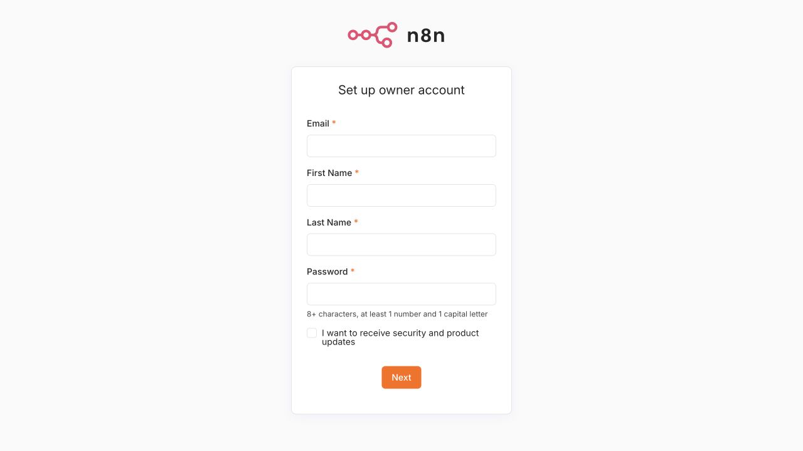
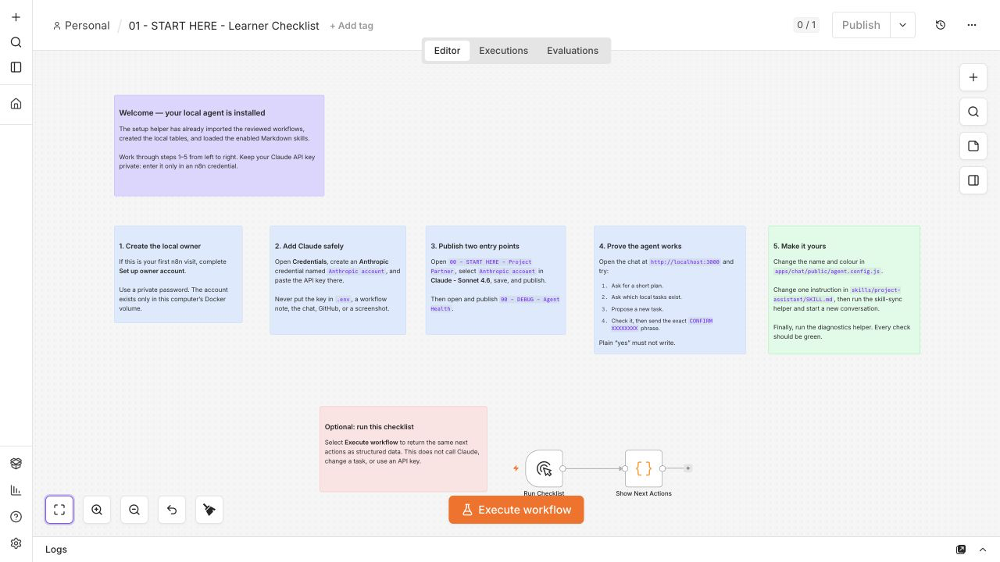

# Getting started — the complete beginner guide

## What you are making

You will create a private copy of this project and run an AI project assistant
on your own computer. You will open the assistant in a web browser, but it is
not published on the internet.

You do not need to know how to code. You will mostly:

1. click buttons in GitHub and Claude Desktop;
2. ask Claude Code to set up the project;
3. connect your Claude API key inside n8n;
4. edit a few clearly labelled words;
5. save your changes with GitHub Desktop.

Allow 30–45 minutes for the first setup. The first npm download is the slowest
part.

## Four names you will see

| Name | Plain-language meaning |
| --- | --- |
| GitHub | The website that stores your project files |
| Claude Code | The Code area in Claude Desktop that copies and sets up the project for you |
| Node.js | The engine that runs the project; setup supplies a private copy automatically when needed |
| n8n | The visual canvas where you can see and change the AI agent |

Claude is the AI model. An Anthropic API key lets this local project call
Claude. A paid Claude web subscription and API credit are separate products.

## Before you begin

Have these ready:

- [ ] A GitHub account.
- [ ] Claude Desktop installed, signed in, and open in Code mode.
- [ ] GitHub Desktop installed and signed in.
- [ ] An Anthropic Console API key with a small positive credit balance.
- [ ] At least 6 GB of free disk space for first setup; 8 GB is recommended.
- [ ] A current Chrome, Edge, Firefox, or Safari browser.
- [ ] A stable internet connection for the first download and Claude calls.

Follow the [prerequisite guide](WORKSHOP_PREREQUISITES.md) if any checkbox is
unfamiliar. No WSL2 or virtualization setup is needed.

Windows support means Windows 10 or 11 on an x64 computer, or Windows 11 on an
ARM-based computer such as a Snapdragon laptop. Windows 11 runs the project's
reviewed x64 runtime through its built-in emulation. Windows 10 on ARM is not
supported.

Keep the API key private. Never paste it into GitHub, GitHub Desktop, a chat
message, `.env`, a screenshot, or an issue. It belongs only in the n8n
credential screen described below.

## Part 1 — put your own copy on the computer

### Create the private repository

1. Open the project repository on GitHub.
2. Select **Use this template**.
3. Select **Create a new repository**.
4. Choose your own GitHub account as the owner.
5. Enter a short project name.
6. Choose **Private**.
7. Leave **Include all branches** switched off.
8. Select **Create repository**.

If **Use this template** is not visible, ask the instructor for the release ZIP.
Unzip it into a normal Documents folder; do not run it from inside the ZIP.
On Windows, use a short local folder outside OneDrive and outside a network/UNC
path. `C:\ai-workshop\your-project` is a good example when your computer allows
it.

### Bring it into Claude Code

1. Open your new repository on GitHub.
2. Select **Code** and keep **HTTPS** selected.
3. Copy the repository URL.
4. Open Claude Desktop in Code mode.
5. Ask: `Please clone this repo: <paste your repository URL>`. On Windows add:
   `Use a short local folder outside OneDrive or a network path.`
6. Open the cloned project in the Claude Code session.

You should now see `README.md` and several files ending in `.command` or
`.cmd`. The [GitHub Desktop guide](GITHUB_DESKTOP.md) has screenshots-in-words
for the alternative visual clone workflow and every save and push action.

## Part 2 — run the one-click setup

Ask Claude Code:

```text
Read the README and the existing setup scripts in this repository.
Start the local services using the project's documented one-click setup.
On Windows, set AI_SOLO_NO_PAUSE=1 before running the .cmd helper.
Keep them running, verify the chat and n8n URLs, then open those two pages for me.
```

Claude chooses the correct helper for your computer. You can also run it yourself:

On Windows, you can double-click `preflight-windows.cmd` before the large
package download. It checks the reviewed runtime pair, free disk space,
project-folder access, local ports, and npm registry access. Setup repeats these
checks on both platforms.

### macOS

Double-click `setup.command`.

If macOS blocks it:

1. Control-click `setup.command`.
2. Choose **Open**.
3. Choose **Open** again in the confirmation window.

### Windows

Double-click `setup-windows.cmd`.

The helper does not need administrator access. If Windows unexpectedly asks for
an administrator password or permission to make system changes, cancel and ask
the instructor for help. A managed-device or SmartScreen warning is a separate
policy check; do not bypass an organisation's policy.

When Claude Code runs a Windows launcher, it sets `AI_SOLO_NO_PAUSE=1` so the
launcher returns its real result without waiting for a key. When you double-click
the same file, it pauses at the end so you can read the result.

### What setup is doing

The terminal window will:

- use the exact reviewed Node.js 24.18.0 and npm 11.16.0 pair if it is already
  available, or download a verified private copy into this project;
- confirm at least 6 GB is free for first setup and that the project folder is
  writable;
- check the chat, n8n, and internal document-reader ports;
- download the exact reviewed n8n release with npm;
- install the exact document-reader packages with npm;
- build the chat app;
- start n8n, the document reader, and the chat in the background;
- import eleven reviewed workflows;
- create three sample project tasks;
- load the enabled Markdown skills.

The private Node.js and npm copy does not change the rest of your computer, need
administrator access, or require a restart. It lives in the Git-ignored
`.runtime/` folder.

It is normal for the first run to spend several minutes downloading packages.
Do not close the terminal window. Setup is finished when it prints:

```text
Local stack is healthy.
  Chat app:          http://localhost:3000
  n8n editor:        http://localhost:5678
```

If setup stops, start with the [troubleshooting table](TROUBLESHOOTING.md).
Automatic import can safely be repeated with `import-workflows.command` on
macOS or `import-workflows-windows.cmd` on Windows.

## Part 3 — create the private local n8n owner

1. Open [http://localhost:5678](http://localhost:5678).
2. On the first visit, n8n asks you to create an owner account.
3. Enter an email-shaped username and a strong password you will remember.
4. Continue until the n8n Overview appears.
5. Open `01 - START HERE - Learner Checklist`.





This account exists only in this project's local data folder on this computer.
It is not your GitHub, Anthropic, or n8n Cloud account.

## Part 4 — connect Claude safely

Turn off screen sharing before showing or pasting the key.

1. In n8n, open **Credentials**.
2. Choose **Create credential**.
3. Search for and choose **Anthropic**.
4. Name it `Anthropic account`.
5. Paste the key into **API Key**.
6. Save the credential.
7. Open `00 - START HERE - Project Partner`.
8. Open the node named **Claude - Sonnet 4.6**.
9. Select `Anthropic account` as its credential.
10. Save, then select **Publish**.
11. Open `90 - DEBUG - Agent Health`.
12. Select **Publish**.

The browser chat never receives the key. n8n stores it encrypted inside the
project's private, Git-ignored data folder.

## Part 5 — check that everything is ready

Close no windows; simply return to the project folder.

- macOS: double-click `diagnose.command`.
- Windows: double-click `diagnose-windows.cmd`.

The diagnostic never sends a Claude request and never displays the key. Follow
each yellow `[next]` instruction. You are ready when it says:

```text
All checks are green. The local agent is ready for a real Claude message.
```

## Part 6 — prove the agent works

Open [http://localhost:3000](http://localhost:3000).

Send these messages one at a time:

1. `Turn my project idea into three clear next steps.`
2. `What tasks are in my local project?`
3. `Create a high-priority task to invite the launch group.`

For the third message, the agent proposes an exact action. Check the fields, then
send the displayed `CONFIRM XXXXXXXX` phrase as a new message within five
minutes. Sending only `yes` must not create anything.


You have succeeded when:

- [ ] the first message receives a useful Claude reply;
- [ ] the second message lists local sample tasks;
- [ ] plain `yes` does not approve a write;
- [ ] the exact confirmation creates one task;
- [ ] refreshing the browser keeps the interface available.

## Part 7 — make it yours

Before customising, try the document path:

1. Open [http://localhost:3000](http://localhost:3000).
2. Select the **+** inside the message box, then choose **Paste long text** and
   paste at least a short paragraph of meeting notes, or choose
   **Upload a file** and select a searchable PDF, DOCX, or TXT file.
3. Wait for the removable document chip to appear inside the message box and
   show its word count.
4. Type:
   `Give me a concise summary, confirmed decisions, action items with owners and due dates, risks, and open questions.`
5. Select **Send**.

The file itself stays in the local app. Extracted text is sent to Claude when
you submit the request. Do not upload secrets you would not send to Anthropic.
Image-only scanned PDFs are not supported in this version. The full limits and
privacy behaviour are in [Use documents and long transcripts](DOCUMENT_UPLOADS.md).

### Change the interface

Open `apps/chat/public/agent.config.js` in a plain text editor. Change only the
quoted values described in [Customise the chat](CUSTOMISE_CHAT.md): the agent
name, welcome message, colour, and example prompts.

Save the file and refresh [http://localhost:3000](http://localhost:3000).

### Change one skill

Open `skills/project-assistant/SKILL.md`. Change one instruction without
removing its safety rules, then save.

- macOS: double-click `sync-skills.command`.
- Windows: double-click `sync-skills-windows.cmd`.

Start a new browser conversation so the new instruction is loaded. Follow
[Customise skills](CUSTOMISE_SKILLS.md) for examples.

## Part 8 — save your project

In GitHub Desktop:

1. Review the changed file names and make sure `.env`, `data`, and `backups` are absent.
2. In **Summary**, type `Customise my project partner`.
3. Select **Commit to main**.
4. Select **Push origin**.
5. Open your GitHub repository and confirm the new commit is visible.

Local n8n accounts, credentials, tasks, and conversation memory are not uploaded
to GitHub. Only the project files you reviewed are pushed.

## Part 9 — stop safely and come back later

Before an experiment, create a private backup:

- macOS: double-click `backup.command`.
- Windows: double-click `backup-windows.cmd`.

Treat `backups/` like a password. It contains encrypted credentials and local
settings.

To stop at the end of the day:

- macOS: double-click `stop.command`.
- Windows: double-click `stop-windows.cmd`.

To return later:

1. Double-click `start.command` or `start-windows.cmd`.
2. Open [http://localhost:3000](http://localhost:3000).

Stopping preserves your local work. Reset is different: it permanently removes
the local n8n account, credentials, workflows, tasks, history, and extracted
document context. Do not run a reset unless you understand the
[backup and recovery guide](LOCAL_OPERATIONS.md).

## When something does not work

Use this order:

1. Read the exact terminal or browser message once.
2. Run `diagnose.command` or `diagnose-windows.cmd`.
3. Follow its first yellow `[next]` instruction.
4. Search the [troubleshooting table](TROUBLESHOOTING.md).
5. Ask for help without sharing `.env`, an API key, a backup, or screenshots of
   the credential screen.

The two most useful local addresses are:

- Chat: [http://localhost:3000](http://localhost:3000)
- n8n: [http://localhost:5678](http://localhost:5678)

If one address is unavailable after a restart, wait one minute and run the
diagnostic again.
