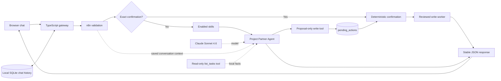

# Connect the Visual n8n Agent to Claude

## Outcome

At the end of this guide:

- n8n will show a small, documented visual agent workflow.
- A five-step learner checklist will be visible beside the agent workflow.
- The Claude API key will be stored only in n8n's encrypted credential store.
- The browser chat will send messages through n8n to Claude.
- Each browser conversation will have separate, restart-safe local memory.
- Local tables will contain three starter tasks and the enabled skill bundle.
- Creating or updating a task will require an exact, expiring confirmation.
- A second, credential-free workflow will provide a safe local health check.

Allow about 15 minutes after the local stack is running.

## Before starting

Complete [LOCAL_SETUP.md](LOCAL_SETUP.md), then confirm:

- The local services are running (`start.command` or `start-windows.cmd`).
- The chat opens at [http://localhost:3000](http://localhost:3000).
- n8n opens at [http://localhost:5678](http://localhost:5678).
- A local n8n owner account has been created.
- One team member can sign in to the [Anthropic Console](https://console.anthropic.com/).

Anthropic API access is billed separately from a Claude web-chat subscription. The workspace needs a small amount of API credit before a real request can succeed. Anthropic documents [prepaid API billing](https://support.anthropic.com/en/articles/8977456-how-do-i-pay-for-my-api-usage) and [workspace spend limits](https://platform.claude.com/docs/en/manage-claude/workspaces).

## 1. Confirm the automatic workflow import

The repository includes eleven reviewed workflow exports. First setup imports them automatically, so learners do not need to build nodes from a blank canvas.

Refresh the n8n Overview. If `01 - START HERE - Learner Checklist` appears, continue to step 2.

If the workflows are missing or automatic import was interrupted, use the repeatable manual fallback:

### macOS

Double-click `import-workflows.command`.

If macOS blocks it, Control-click the file, choose **Open**, then confirm.

### Windows

Double-click `import-workflows-windows.cmd`.

The fallback opens a terminal, checks the workflows and Markdown skills, starts n8n if needed, and imports all eleven workflows. It briefly enables localhost-only setup endpoints to create local tables and sync enabled skills, then immediately removes both endpoints. It publishes the reviewed runtime subworkflows but does not publish the main agent, health workflow, or an API key.

Refresh the n8n Overview. All eleven workflows should appear:

- `00 - START HERE - Project Partner`
- `01 - START HERE - Learner Checklist`
- `10 - SETUP - Local Task Data`
- `11 - SETUP - Sync Enabled Skills`
- `20 - TOOL - list_tasks`
- `21 - TOOL - create_task`
- `22 - TOOL - update_task_status`
- `30 - TOOL - Propose create_task`
- `31 - TOOL - Propose update_task_status`
- `40 - CONFIRM - Task Write`
- `90 - DEBUG - Agent Health`

The six runtime dependencies—read tool, two proposal tools, confirmation dispatcher, and two write workers—are published automatically. The write workers are callable only by workflow `40`; no AI Tool node points to them. The main agent, health workflow, and two temporary setup workflows remain inactive drafts. The learner checklist is an inactive visual guide that can be opened or run manually.

Open **Data tables** in n8n:

- `tasks` contains three rows.
- `tool_audit` is empty until a task tool runs.
- `pending_actions` is empty until the agent proposes a write.
- `agent_config` contains one `enabledSkills` row.

## 2. Create an Anthropic API key

Only one person on each team should handle the key.

1. Open the [Anthropic Console](https://console.anthropic.com/).
2. Select the intended workspace.
3. Open **Settings**, then **API keys**.
4. Create a new key for this local workshop.
5. Give it a recognisable name and an expiry date when that option is available.
6. Copy the key once and keep the Console tab open until it is saved in n8n.

Anthropic's [authentication guide](https://platform.claude.com/docs/en/manage-claude/authentication) explains how API keys authenticate requests.

Never put this key in `.env`, `agent.config.js`, a workflow sticky note, a screenshot, Git, or a chat message. If it is exposed, revoke it in the Anthropic Console and create a replacement.

## 3. Store the key in n8n

1. In n8n, open **Credentials**.
2. Select **Create credential**.
3. Search for and select **Anthropic**.
4. Set the credential name to `Anthropic account`.
5. Paste the key into **API Key**.
6. Leave **Base URL** at its default value.
7. Save the credential.

The key is encrypted using the private n8n encryption key generated during local setup. The browser chat and chat gateway never receive it.

## 4. Inspect and publish the agent

Open `00 - START HERE - Project Partner`. The sticky notes describe the read, proposal, and confirmation paths.

| Part | What it does |
| --- | --- |
| **Chat Webhook** | Receives the private request from the chat gateway |
| **Validate and Normalise** | Checks the request ID, session, agent, durable history, message, and bounded document context |
| **Request Is Valid?** | Ensures only the valid branch can reach the agent |
| **Route Confirmation** | Recognises only a complete `CONFIRM XXXXXXXX` message |
| **Load Enabled Skills** | Reads the bundle compiled from `skills/enabled.txt` |
| **Build Agent Context** | Separates saved history, the current instruction, documents, and enabled skills |
| **Project Partner Agent** | Runs the Project Manager instructions and controls the number of model steps |
| **Claude - Sonnet 4.6** | Calls Claude using the n8n credential |
| **list_tasks** | Retrieves task facts through the reviewed read-only subworkflow |
| **create_task** | Validates and stores a five-minute create proposal without changing tasks |
| **update_task_status** | Validates and stores a five-minute status proposal without changing tasks |
| **Confirm Stored Action** | Calls the deterministic confirmation workflow before either write worker |
| **Return Agent Reply** | Returns only `sessionId`, `reply`, and `runId` |
| **Return Invalid Request** | Returns a safe 400 or 413 response without calling Claude |

Then:

1. Open **Claude - Sonnet 4.6**.
2. Select `Anthropic account` under **Credential to connect with**.
3. Confirm the model is Claude Sonnet 4.6. The maintained model identifiers are listed in Anthropic's [model documentation](https://platform.claude.com/docs/en/about-claude/models/model-ids-and-versions).
4. Save the workflow.
5. Select **Publish**.

Keep the supplied safety and cost ceilings during the workshop:

- 4 agent iterations.
- 2,200 provider output tokens.
- 110-second workflow timeout.
- 8,000-character response ceiling.
- Streaming disabled for the synchronous chat contract.

## 5. Publish the safe health workflow

Open `90 - DEBUG - Agent Health`, inspect it, then select **Publish**.

Open [http://localhost:5678/webhook/agent-health](http://localhost:5678/webhook/agent-health). A successful response resembles:

```json
{
  "status": "ok",
  "service": "n8n",
  "workflow": "agent-health",
  "timestamp": "2026-07-26T00:00:00.000Z"
}
```

This proves that n8n can run a published workflow. It deliberately does not call Claude and does not reveal credentials, execution data, or configuration.

## 6. Run readiness diagnostics

Double-click `diagnose.command` on macOS or `diagnose-windows.cmd` on Windows.

The helper checks the local services, the installed learner checklist, main
workflow publication, the selected Anthropic credential, the credential-free
validation path, and the health workflow. It never calls Claude or displays
credential values.

Resolve each yellow `[next]` line. Continue when it reports **All checks are green**.

## 7. Send the first message

Open [http://localhost:3000](http://localhost:3000) and try:

> Help me turn my project idea into three clear next steps.

Then try:

> What tasks are in my local project?

Finally try:

> Create a high-priority task to invite the pilot group.

Check the proposed fields. Copy the returned `CONFIRM XXXXXXXX` phrase and send it as a separate message within five minutes. Plain `yes` does not approve the change.

A successful request follows this path:



The browser creates a `sessionId` and reuses it for the conversation. Select **New conversation** to create a separate session.

Read tools run automatically. Model-facing write tools can only store proposals. The exact phrase is bound to the same browser `sessionId` and stored arguments, expires after five minutes, and is consumed before a write. See [SAFE_WRITE_CONFIRMATION.md](SAFE_WRITE_CONFIRMATION.md).

To change agent behaviour without editing the workflow, follow [CUSTOMISE_SKILLS.md](CUSTOMISE_SKILLS.md).

## Memory and restart behaviour

The chat gateway owns durable conversation memory:

- Every user and assistant message is stored in local plaintext SQLite.
- The latest six complete turns that fit within 24,000 characters are supplied
  to the agent.
- History is isolated by conversation UUID and agent ID.
- Restarting n8n or the chat gateway preserves the transcript and recent context.
- **New conversation** intentionally starts without another chat's context.

The workflow deliberately has no Simple Memory connection. Adding it back would
duplicate recent turns and make pre-restart behaviour differ from post-restart
behaviour. This remains single-user local storage, not a production multi-user
memory service.

## Troubleshooting

Use [TROUBLESHOOTING.md](TROUBLESHOOTING.md) when:

- The imported workflows do not appear.
- The chat says the agent is not ready.
- The Claude credential fails.
- The Anthropic workspace has no credit or reaches a rate limit.
- The agent health endpoint returns 404.
- The agent forgets a conversation after restart.

The browser shows safe, short errors. Open the most recent n8n execution to diagnose a failed node; do not copy credentials or complete execution payloads into a public issue.

## Technical contributor commands

Validate workflow structure without starting n8n:

```bash
node scripts/validate-workflows.mjs
```

After validation, use a throwaway local conversation to manually check the
workflow path you changed. For a write path, verify that the agent proposes the
exact action, rejects plain `yes`, accepts only the generated confirmation code,
and performs the action once.

Export timestamped copies of visually edited workflows:

```bash
./scripts/export-workflows.sh
```

The ignored `n8n/exports/` directory is a normalised review area, not the canonical source. Follow [WORKFLOW_DEVELOPMENT.md](WORKFLOW_DEVELOPMENT.md) to compare and promote only the intended file.
