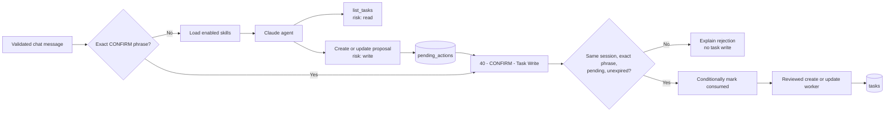

# Safe Write Confirmation

## Outcome

The agent may read task data automatically. Creating a task or changing a task status requires a separate, exact confirmation from the same browser conversation.

The safety boundary is deterministic: Claude can prepare a proposal, but it cannot call the task-writing workers directly.

## What the learner sees

Ask:

> Create a high-priority task to invite the pilot group.

The agent describes the exact proposal and returns a phrase similar to:

```text
CONFIRM A1B2C3D4
```

No task has changed yet. To approve:

1. Check the title, status, priority, and any due date in the proposal.
2. Copy the complete phrase.
3. Send it as a separate message within five minutes.

The chat responds with the created or updated task only after the stored action succeeds.

Plain `yes`, `confirm`, an altered phrase, an older phrase, or a phrase from another browser conversation cannot approve the write.

## Visual workflow



The exact confirmation branch runs before the AI Agent. Confirmation messages therefore do not rely on model interpretation and do not consume Claude API credit.

## Stored confirmation record

The local `pending_actions` Data Table stores:

| Field | Purpose |
| --- | --- |
| `actionId` | UUID used as the write idempotency key |
| `sessionId` | Browser conversation allowed to confirm |
| `actionType` | `create_task` or `update_task_status` |
| `proposedInput` | Exact normalised arguments stored as JSON |
| `confirmationText` | Exact short phrase shown to the user |
| `status` | `pending`, `superseded`, `consumed`, or `expired` |
| `expiresAt` | Five-minute deadline |
| `consumedAt` | Time the proposal stopped being usable |

A newer proposal in the same conversation marks an older pending proposal `superseded`.

The confirmation workflow updates a matching `pending` record to `consumed` using the action ID, session ID, and current status as conditions. It verifies that update before dispatching the write. Even two simultaneous copies of the same phrase can produce only one task mutation.

The stored `proposedInput`, rather than conversation memory or a new model interpretation, supplies the write-worker arguments.

## Tool-risk policy

The machine-readable policy is in `tools/policy.json`.

| Tool | Risk | Mode | Model effect |
| --- | --- | --- | --- |
| `list_tasks` | `read` | Automatic | Reads reviewed local task fields |
| `create_task` | `write` | Confirmation required | Stores a proposal only |
| `update_task_status` | `write` | Confirmation required | Stores a proposal only |
| `delete_task` | `destructive` | Unavailable | Not connected |
| `archive_task` | `destructive` | Unavailable | Not connected |
| `bulk_change_tasks` | `destructive` | Unavailable | Not connected |

The model-facing write-tool names point to workflows `30` and `31`, which cannot mutate `tasks`. Workflow `40` is the only dispatcher for the two idempotent write workers. The worker workflows are published because n8n subworkflows need to be callable, but no AI Tool node points to them.

Arbitrary SQL, HTTP, shell, filesystem, delete, archive, and bulk-change nodes remain outside every model-callable workflow.

## Rejection behaviour

| Situation | Result |
| --- | --- |
| Plain “yes” | Agent reminds the user to send the exact phrase |
| Altered or invented phrase | `CONFIRMATION_NOT_FOUND` |
| Phrase from another session | `CONFIRMATION_NOT_FOUND` |
| Older phrase after a newer proposal | `CONFIRMATION_SUPERSEDED` |
| Phrase older than five minutes | `CONFIRMATION_EXPIRED` |
| Repeated phrase | `CONFIRMATION_ALREADY_USED` |
| Missing local confirmation table | Recoverable setup instruction |
| Write fails after consumption | Failure is reported; a new proposal is required |

Requiring a new proposal after a failed confirmed write preserves single-use behaviour. The underlying write workers also use `actionId` as their idempotency key.

## Contributor extension rules

Before adding another state-changing tool:

1. Classify it in `tools/policy.json`.
2. Create a proposal-only model-facing workflow with strict inputs.
3. Store normalised arguments rather than model prose.
4. Add the action to the confirmation workflow allowlist.
5. Consume confirmation before dispatch.
6. Use an idempotent, narrowly scoped execution worker.
7. Audit proposal and execution outcomes.
8. Manually exercise altered, cross-session, expired, superseded, repeated, and simultaneous confirmations in a throwaway local project.
9. Keep destructive actions unavailable for the local release.
